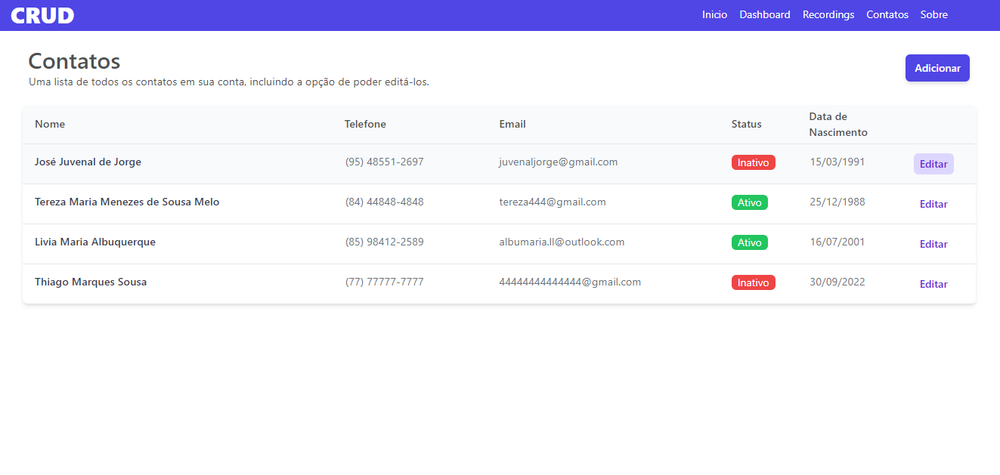
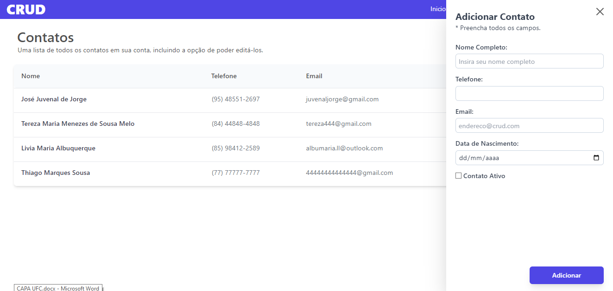
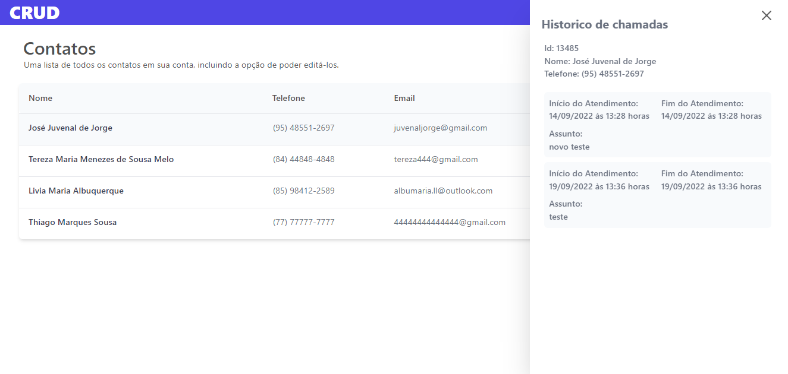
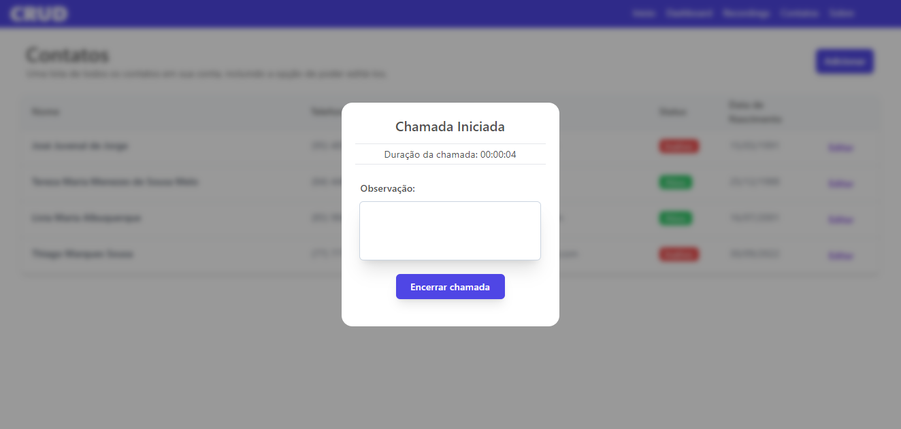
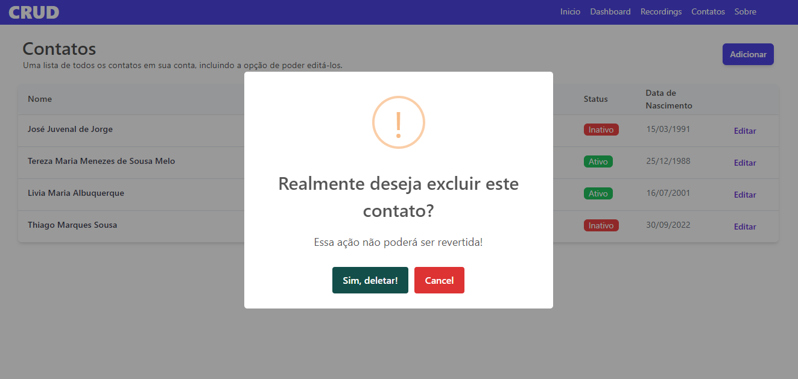

# Sobre o sistema

Este projeto foi criado utilizando ReactJS e Tailwind. Para realizar todos os tipos de requisições com o JSON (CRUD), foi utilizado uma API online e para a mesma foi utilizado o AXIOS.

### As imagens abaixo mostram a interface do sistema Web

